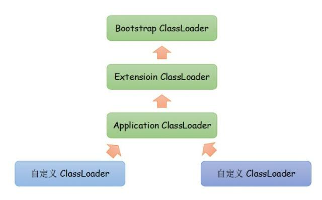

## 了解过字节码的编译过程吗？

## 如何实现两金额数据相加（最多小数点两位）?


## 双亲委派模型中，从顶层到底层，都是哪些类加载器，分别加载哪些类？
*_相似问题：说说双亲委派模型？_*  
双亲委派的意思是如果一个类加载器需要加载类，那么首先它会把这个类请求委派给父类加载器去完成，每一层都是如此。一直递归到顶层，当父加载器无法完成这个请求时，子类才会尝试去加载。这里的双亲其实就指的是父类，没有mother。父类也不是我们平日所说的那种继承关系，只是调用逻辑是这样。


双亲委派的作用：  
在Java中，对于任意一个类，都需要由加载它的类加载器和这个类本身一同确立其在虚拟机中的唯一性。因此，使用双亲委派模型来组织类加载器之间的关系，有一个显而易见的好处：类随着它的类加载器一起具备了一种带有优先级的层次关系。

例如类java.lang.Object，它由启动类加载器加载。双亲委派模型保证任何类加载器收到的对java.lang.Object的加载请求，最终都是委派给处于模型最顶端的启动类加载器进行加载，因此Object类在程序的各种类加载器环境中都是同一个类。

一个符合规范的类加载器，应当仅覆写ClassLoader#findClass()，以支持自定义的类加载方式。不建议覆写ClassLoader#loadClass()（以使用默认的类加载逻辑，即双亲委派模型）；如果需要覆写，则不应该破坏双亲委派模型。不会出现相同全限定名的类被不同类加载器加载的问题，也就不会引起混乱了。


类加载器按从顶到底：  
启动类加载器(bootstrap classLoader，级别最高)  
扩展类加载器(extension)  
应用类加载器(Application)  
自定义类加载器(user ClassLoader);

（1）启动类加载器（Bootstrap ClassLoader）  
这个类加载器负责将存放在JAVA_HOME/lib下的，或者被-Xbootclasspath参数所指定的路径中的，并且是虚拟机识别的类库加载到虚拟机内存中。启动类加载器无法被Java程序直接引用。  
（2）扩展类加载器（Extension ClassLoader）  
这个加载器负责加载JAVA_HOME/lib/ext目录中的，或者被java.ext.dirs系统变量所指定的路径中的所有类库，开发者可以直接使用扩展类加载器。  
（3）应用程序类加载器（Application ClassLoader）  
这个加载器是ClassLoader中getSystemClassLoader()方法的返回值，所以一般也称它为系统类加载器。它负责加载用户类路径（Classpath）上所指定的类库，可直接使用这个加载器，如果应用程序没有自定义自己的类加载器，一般情况下这个就是程序中默认的类加载器

> [Java学习记录--委派模型与类加载器](https://cloud.tencent.com/developer/article/1347591)

## 有没有可能父类加载器和子类加载器，加载同一个类？如果加载同一个类，该使用哪一个类？
如果在双亲委派的模型，不可能同时加载到同一个类。如果一个类加载器收到了类加载的请求，它首先不会自己去尝试加载这个类，而是把这个请求委托给父类加载器去完成，每一层次的加载器都是如此。因此所有的类加载请求都会传给顶层的启动类加载器，只有当父加载器反馈自己无法完成该加载请求（该加载器的搜索范围中没有找到对应的类）时，子加载器才会尝试自己去加载。  

如果打破了双亲委派模型（不是强制性约束），确实可以加载同一个类。  

如果加载同一个类，那要根据当前线程上下文类加载器是哪个来确定使用了哪个类，如果是父类加载器则使用父类加载器加载的类，否则反之。

类加载过程：  
（1）通过findLoadedClass()，查看请求的类是否被加载过；  
（2）若没有加载，则调用父类加载器的loadClass()方法进行加载；  
（3）若父类加载器加载为空则用启动类加载器作为父类加载器；  
（4）如果父类加载失败，则抛出异常；  
（5）然后再调用自己的findClass()方法进行加载；  
（6）最后判断该类是否进行解析resolveClass()；  

> [细说JVM（类加载器）](https://zhuanlan.zhihu.com/p/41672523)

## 简单说说你了解的类加载器，可以打破双亲委派么，怎么打破？
改变线程上下文类加载器。

>Java 提供了很多服务提供者接口（Service Provider Interface，SPI），允许第三方为这些接口提供实现。常见的 SPI 有 JDBC、JCE、JNDI、JAXP 和 JBI 等。

>这些 SPI 的接口由 Java 核心库来提供，而这些 SPI 的实现代码则是作为 Java 应用所依赖的 jar 包被包含进类路径（CLASSPATH）里。SPI接口中的代码经常需要加载具体的实现类。那么问题来了，SPI的接口是Java核心库的一部分，是由**启动类加载器(Bootstrap Classloader)来加载的；SPI的实现类是由系统类加载器(System ClassLoader)**来加载的。引导类加载器是无法找到 SPI 的实现类的，因为依照双亲委派模型，BootstrapClassloader无法委派AppClassLoader来加载类。

>而线程上下文类加载器破坏了“双亲委派模型”，可以在执行线程中抛弃双亲委派加载链模式，使程序可以逆向使用类加载器。JDBC加载实现类就是使用了
>```
>Class.forName(aDriver, true, ClassLoader.getSystemClassLoader());
>```
>ClassLoader.getSystemClassLoader方法无论何时均会返回ApplicationClassLoader。


> [真正理解线程上下文类加载器（多案例分析）](https://blog.csdn.net/yangcheng33/article/details/52631940)

## JAVA动态编译方式？
```
public static void main(String[] args) throws Exception{
    JavaCompiler compiler = ToolProvider.getSystemJavaCompiler();
    int flag = compiler.run(null, null, null,"D:\\HelloWorld.java");
    System.out.println(flag == 0 ? "编译成功" : "编译失败");
}
```

## 讲讲JAVA的反射机制？
反射机制是在运行状态中，对于任意一个类，都能够知道这个类的所有属性和方法，还有父类，接口信息，注解信息；对于任意一个对象，都能够调用它的任意一个方法和属性；这种动态获取的信息以及动态调用对象的方法的功能称为java语言的反射机制。

| 方法 | 作用 |
| --- | --- |
| getDeclaredMethods() | 获取所有的方法 |
| getReturnType() | 获得方法的返回类型 |
| getParameterTypes() | 获得方法的传入参数类型 |
| getDeclaredMethod("",.class,……) | 获得特定的方法 |
| getDeclaredConstructors() | 获取所有的构造方法 |
| getDeclaredConstructor(.class,……) | 获取特定的构造方法 |
| getSuperclass() | 获取某类的父类 |
| getInterfaces() | 获取某类实现的接口 |
| method.invoke(owner, args); | 执行方法 |
| field.set(owner, value); | 设置属性值 |
| field.get(owner); | 获取属性值 |
| setAccessible(true) | 私有属性或者方法，需要打开可见权限 |
| asSubclass(Class<U> clazz) | 作用是将调用这个方法的class对象转换成由clazz参数所表示的class对象的某个子类。 |
| cast(object) | HttpServletRequest request = HttpServletRequest.class.cast(req) |

注:要想获取到annotation，annotation必须标注@Retention(RetentionPolicy.RUNTIME)

> [Java基础之反射机制详解](https://www.jianshu.com/p/381ec446a318)  
> [Java中反射机制详解](https://www.cnblogs.com/whgk/p/6122036.html)

## 反射的原理，反射创建类实例的三种方式是什么？
1、Class clazz1 = Class.forName("全限定类名");　　//获取声明时的类

2、Class clazz2  = Person.class;　　　　//获取运行时的类

3、Class clazz3 = p.getClass();　　　　//通过类名来获得类

## 反射中，Class.forName和ClassLoader区别？
Java中Class.forName和classloader都可以用来对类进行加载。  
Class.forName除了将类的.class文件加载到jvm中之外，还会对类进行解释，执行类中的static块。  
而classloader只干一件事情，就是将.class文件加载到jvm中，不会执行static中的内容，只有在newInstance才会去执行static块。

mysql驱动为什么使用Class.forName来加载驱动类，而不是classloader：
```
public class Driver extends NonRegisteringDriver implements java.sql.Driver {
    public Driver() throws SQLException {
    }

    static {
        try {
            DriverManager.registerDriver(new Driver());
        } catch (SQLException var1) {
            throw new RuntimeException("Can't register driver!");
        }
    }
}
```
正是利用了Class.forName可以初始化类，执行static块中注册驱动到驱动管理器的代码。而classloader不会执行static块中的代码。

## Java 泛型是什么？
讲泛型不可不提类型擦除，只有明白了类型擦除，才算明白了泛型，也就可以避开使用泛型时的坑。  
严格来说，Java 的泛型并不是真正的泛型。Java 的泛型是 JDK1.5 之后添加的特性，为了兼容之前版本的代码，其实现引入了类型擦除的概念。  
类型擦除指的是：Java 的泛型代码在编译时，由编译器进行类型检查，之后会将其泛型类型擦除掉，只保存原生类型，如 Generics<Long> 被擦除后是 Generics，我们常用的 List<String> 被擦除后只剩下 List。  
接下来的 Java 代码在运行时，使用的还是原生类型，并没有一种新的类型叫 泛型。这样，也就兼容了泛型之前的代码。  
实际上，实现了泛型的代码的字节码内会有一个 signature 字段，其中指向了常量表中泛型的真正类型，所以泛型的真正类型，还可以通过反射获取得到。

那么类型擦除之后，Java 是如何保证泛型代码执行期间没有问题的呢？  
我们将一段泛型代码用 javac 命令编译成 class 文件后，再使用 javap 命令查看其字节码信息：  
我们会发现，类型里的 T 被替换成了 Object 类型，而在 main 方法里 getField 字段时，进行了类型转换(checkcast)，如此，我们可以看出来 Java 的泛型实现了，一段泛型代码的编译运行过程如下：  
编译期间编译器检查传入的泛型类型与声明的泛型类型是否匹配，不匹配则报出编译器错误；  
编译器执行类型擦除，字节码内只保留其原始类型；  
运行期间，再将 Object 转换为所需要的泛型类型。  
也就是说：Java 的泛型实际上是由编译器实现的，将泛型类型转换为 Object 类型，在运行期间再进行状态转换。  

> [Java高级特性之泛型](https://blog.csdn.net/shunqixing/article/details/80319396)  
> [Java 泛型，你了解类型擦除吗？](https://blog.csdn.net/briblue/article/details/76736356)

## 为什么泛型不能是基础类型如int,long等?
因为java的泛型是用类型擦除实现的，不是真正的泛型，实际运行阶段用的都是Object(当然有泛型限定的除外, 如T extends String, 类型就是String)，而基本数据类型不继承自Object，也就无法在泛型中使用。
或者说因为编译器进行类型擦除后会使用 Object 替换泛型类型，并在运行期间进行类型转换，而基础类型和 Object 之间是无法替换和转换的。

## static有什么用途？（请至少说明两种）
1.用来修饰成员变量，将其变为类的成员，从而实现所有对象对于该成员的共享；  
2.用来修饰成员方法，将其变为类方法，可以直接使用“类名.方法名”的方式调用，常用于工具类；  
3.静态块用法，将多个类成员放在一起初始化，使得程序更加规整，其中理解对象的初始化过程非常关键；  
4.静态导包用法，将类的方法直接导入到当前类中，从而直接使用“方法名”即可调用类方法，更加方便。  

题外话：  
java8中继承了一些jdk7中的改变：符号引用存储在native heap中，字符串常量和静态类型变量存储在普通的堆区中。  
java8中移除了永久代，新增了元空间，其实在这两者之间存储的内容几乎没怎么变化，而是在内存限制、垃圾回收等机制上改变较大。元空间的出现就是为了解决突出的类和类加载器元数据过多导致的OOM问题，而从jdk7中开始永久代经过对方法区的分裂后已经几乎只存储类和类加载器的元数据信息了，到了jdk8，元空间中也是存储这些信息，而符号引用、字符串常量等存储位置与jdk7一致在普通的堆区。符号引用没有存在元空间中，而是存在native heap中，这是两个方式和位置，不过都可以算作是本地内存，在虚拟机之外进行划分，没有设置限制参数时只受物理内存大小限制，即只有占满了操作系统可用内存后才OOM。

> [Java中，new子类会实例化父类么？](https://baijiahao.baidu.com/s?id=1611130090523334268&wfr=spider&for=pc)  
> 比较有意思的东西，子类的构造方法会隐式的调用父类的构造方法。为什么要调用父类构造方法呢，还阻止不了？因为对父类继承过来的属性第一步是在父类的构造方法中赋值的，所以java规定了，子类构造方法会隐式的调用父类的构造方法。哪怕代码里写了属性=xx，但赋值操作还是在构造方法里的。同时还说明了一个问题，构造方法执行并不一定创建出对象来。

## final有什么用途？
基础的就不说了。  
final可以保证一旦创建就能被所有线程看到，不会因为有序性的问题，导致线程获得到的引用指向的是一个null对象。  
读final域重排序规则  
在一个线程中，初次读对象引用和初次读该对象包含的final域，JMM会禁止这两个操作的重排序。（注意，这个规则仅仅是针对处理器），处理器会在读final域操作的前面插入一个LoadLoad屏障。实际上，读对象的引用和读该对象的final域存在间接依赖性，一般处理器不会重排序这两个操作。但是有一些处理器会重排序，因此，这条禁止重排序规则就是针对这些处理器而设定的。

## String类能被继承吗，为什么？
不可以，因为String类有final修饰符，而final修饰的类是不能被继承的，实现细节不允许改变。

为什么要设计成final？  
String不可变性其实是final和private的组合。final控制char数组引用不可变，private控制数组内容不允许修改。  
1.为了实现字符串池  
2.为了线程安全  
3.为了实现String可以创建HashCode不可变性  
因为只有当字符串是不可变的，字符串池才有可能实现。字符串池的实现可以在运行时节约很多heap空间，因为不同的字符串变量都指向池中的同一个字符串。但如果字符串是可变的，那么String interning将不能实现，因为这样的话，如果变量改变了它的值，那么其它指向这个值的变量的值也会一起改变。  
因为字符串是不可变的，所以是多线程安全的，同一个字符串实例可以被多个线程共享。这样便不用因为线程安全问题而使用同步。字符串自己便是线程安全的。  
因为字符串是不可变的，所以在它创建的时候HashCode就被缓存了，不需要重新计算。这就使得字符串很适合作为Map中的键，字符串的处理速度要快过其它的键对象。这就是HashMap中的键往往都使用字符串。

## 讲讲类的实例化顺序，比如父类静态数据，构造函数，字段，子类静态数据，构造函数，字段，当new的时候，他们的执行顺序？
父类静态变量、   
父类静态代码块、   
子类静态变量、   
子类静态代码块、   
父类非静态变量（父类实例成员变量）、   
父类构造函数、   
子类非静态变量（子类实例成员变量）、   
子类构造函数。  

## JAVA8的ConcurrentHashMap为什么放弃了分段锁，有什么问题吗，如果你来设计，你如何设计？
https://www.jianshu.com/p/f93912fec48b

## IO模型有哪些，讲讲你理解的nio ，他和bio，aio的区别是啥，谈谈reactor模型？
1.什么是BIO,NIO,AIO？  
JAVA BIO：同步并阻塞，服务器实现模式为一个连接一个线程，即客户端有连接请求时服务器端就需要启动一个线程并处理，如果这个连接不做任何事情会造成不必要的开销，当然可以通过线程池机制改善。 
   
  
JAVA NIO：同步非阻塞，服务器实现模式为一个请求一个线程，即客户端发送的连接请求都会注册到多路复用器上，多路复用器轮询到连接有IO请求时才启动一个线程进行处理。  
nio只有acceptor的服务线程是堵塞进行的，其他读写线程是通过注册事件的方式，有读写事件激活时才调用线程资源区执行，不会一直堵塞等着读写操作，Reactor的瓶颈主要在于acceptor的执行，读写事件也是在这一块分发。  

 
上述NIO实现中，需要用户线程定时轮训，去检查IO数据是否就绪，占用应用程序线程资源。IO多路复用模型中，将检查IO数据是否就绪的任务，交给系统级别的select或poll模型，由系统进行监控，减轻用户线程负担。  

  
当用户线程发起io请求后，将socket连接及关注事件注册到selector（多路复用器，os级别线程）上，selector循环遍历socket连接，看是否有关注数据就绪，如果连接有数据就绪后，就通知应用程序，建立线程进行数据读写。同BIO对比，NIO中线程处理的都是有效连接（数据就绪），且一个线程可以分管处理多个连接上的就绪数据，节省线程资源开销。  
1)select:注册的socket事件由数组管理，长度有限制，轮询查找时需要遍历数组。  
2)poll:注册的socket事件由链表实现，数量没有限制，遍历链表轮询查找。  
3)epoll:基于事件驱动思想，采用reactor模式，通过事件回调，无需使用某种方式主动检查socket状态，被动接收就绪事件即可。  
JAVA AIO(NIO2)：异步非阻塞，服务器实现模式为一个有效请求一个线程，客户端的I/O请求都是由OS先完成了再通知服务器应用去启动线程进行处理。

   
AIO基于时间驱动思想，采用proactor模式。数据完成后，由os主动通知应用程序，通过epoll实现，节省了NIO中selector循环遍历检测数据就绪的资源开销。同时，数据copy操作（用户空间<->socket空间）是由os完成的，无需应用程序参与，大大提高应用程序效率。   
2.使用场景  
BIO方式适用于连接数目比较小且固定的架构，这种方式对服务器资源要求比较高，并发局限于应用中，JDK1.4以前的唯一选择，但程序直观简单易理解。  
NIO方式适用于连接数目多且连接比较短（轻操作）的架构，比如聊天服务器，并发局限于应用中，编程比较复杂，JDK1.4开始支持。  
AIO方式使用于连接数目多且连接比较长（重操作）的架构，比如相册服务器，充分调用OS参与并发操作，编程比较复杂，JDK7开始支持。  
3.BIO 同步并阻塞  
tomcat采用的传统的BIO（同步阻塞IO模型）+线程池模式，对于十万甚至百万连接的时候，传统BIO模型是无能为力的：  
①线程的创建和销毁成本很高，在linux中，线程本质就是一个进程，创建销毁都是重量级的系统函数  
②线程本身占用较大的内存，像java的线程栈一般至少分配512K-1M的空间，如果系统线程过高，内存占用是个问题  
③线程的切换成本高，操作系统发生线程切换的时候，需要保留线程的上下文，然后执行系统调用，如果线程数过高可能执行线程切换的时间甚至大于线程执行的时间，这时候带来的表现是系统load偏高，CPUsy使用率很高  
④容易造成锯齿状的系统负载。系统负载是用活动线程数或CPU核心数，一旦线程数量高但外部网络环境不是很稳定，就很容易造成大量请求的结果同时返回，激活大量阻塞线程从而使系统负载压力过大。  

4NIO同步非阻塞  
NIO基于Reactor，当socket有流可读或可写入socket，操作系统会相应的通知引用程序进行处理，应用再将流读取到缓冲区或写入操作系统。也就是，不是一个链接就要对应一个处理线程，而是一个有效请求对应一个线程，当连接没有数据时，是没有工作线程来处理的  
Reactor模型

   
总结：  
综上所述，Reactor和Proactor模式的主要区别就是真正的读取和写入操作是有谁来完成的，Reactor中需要应用程序自己读取或者写入数据，而Proactor模式中，应用程序不需要进行实际的读写过程，它只需要从缓存区读取或者写入即可，操作系统会读取缓存区或者写入缓存区到真正的IO设备.   
同步和异步是相对于应用和内核的交互方式而言的，同步 需要主动去询问，而异步的时候内核在IO事件发生的时候通知应用程序，而阻塞和非阻塞仅仅是系统在调用系统调用的时候函数的实现方式而已。  
> [IO模型有哪些，讲讲你理解的nio ，他和bio，aio的区别是啥，谈谈reactor模型？](https://blog.csdn.net/weixin_42656794/article/details/90700595)  
> [JAVA 中BIO,NIO,AIO的理解](https://www.iteye.com/blog/bbym010-2100868)
> [关于同步，异步，阻塞，非阻塞，IOCP/epoll,select/poll,AIO ,NIO ,BIO的总结](https://blog.csdn.net/chen8238065/article/details/48315085)👍

## 描述动态代理的几种实现方式，分别说出相应的优缺点？

## 动态代理与cglib实现的区别？

## 为什么CGlib方式可以对接口实现代理？

## 如何在父类中为子类自动完成所有的hashcode和equals实现？这么做有何优劣？

## 深拷贝和浅拷贝区别？

## error和exception的区别，CheckedException，RuntimeException的区别？

## 请列出5个运行时异常？

## 在自己的代码中，如果创建一个java.lang.String类，这个类是否可以被类加载器加载？为什么？

## 说一说你对java.lang.Object对象中hashCode和equals方法的理解。在什么场景下需要重新实现这两个方法？

## 在jdk1.5中，引入了泛型，泛型的存在是用来解决什么问题？

## 什么是序列化，怎么序列化，为什么序列化，反序列化会遇到什么问题，如何解决？

## 了解哪设计模式，举例说说在jdk源码哪些用到了你说的设计模式？