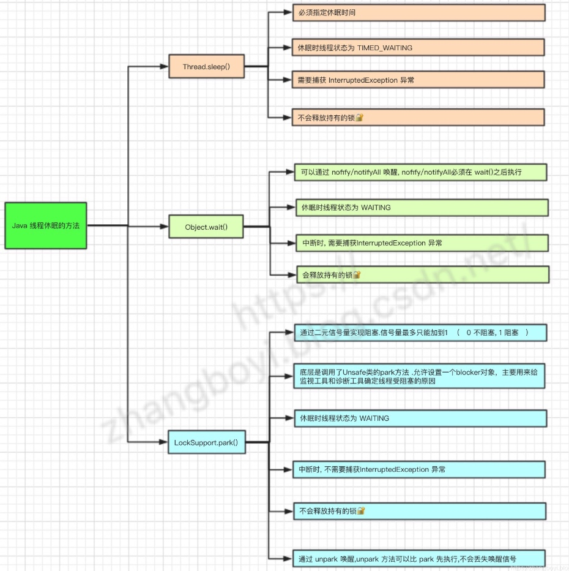

## 如何解决Java变量的可见性问题? 👍
*_相似问题：如何保证内存可见性？_*  
volatile字段可以保证变量的可见性。  
synchronized与lock能保证同步块内变量的可见性和原子性。  
但是：synchronized (this) { }同步块之后的变量也能保证“可见性”，system.out.print()同理，sleep()也可以。因为JVM针对现在的硬件水平已经做了很大程度的优化，基本上很大程度的保障了工作内存和主内存的及时同步，相当于默认使用了volatile，换个方式说只要CPU有喘息机会，喘息后就会从主存里加载新值到工作内存，所以创建大对象也会保证“可见性”。
> [如何解决Java变量的可见性问题](https://blog.csdn.net/weixin_40099554/article/details/79895702)

## synchronized与lock的区别，使用场景，看过synchronized的源码没？👍
*_相似提问：说说Java锁有哪些种类，以及区别？_*

区别：lock包含synchronized所有功能外，还提供了公平性锁机制、多路选择性通知，锁等待中断。（尝试性加锁，是否有线程已经获取了锁，等待锁的线程个数等等非常灵活）  
场景：synchronized少量线程同步，lock大量线程同步。  

synchronized优化：  
首先线程的阻塞和唤醒都需要在用户态和内核态之间的切换，这种操作重且耗时，优化主要目标就是减少这种切换的次数。  
**偏向锁：**同一个线程多次获取相同的锁，只加锁一次。没有竞争的情况。  
**轻量级锁：**主要是多线程顺序执行，不同时争抢锁的情况，同样只是通过CAS改对象头及栈桢中的锁记录，相当于一个过渡阶段，尽量不直接上升到重量级锁。  
**自旋锁：**轻量级也失效，还不会阻塞线程，虚拟机会让线程自旋几十个空循环再尝试获取锁，如果还失败就只能上升到重要级锁了。所以如果线程持有锁的时间很长，那自旋锁只是浪费CPU，可以通过启动参数设置。  
**重量级锁：**用户态和内核态切换，线程阻塞。  

虚拟机还有种锁粗化：如果虚拟机探测到很多零碎的操作都对同一个对象加锁，将会把加锁同步的范围扩展（粗化）到整个操作序列的外部。即加大了同步块。

题外话：  
ReentrantReadWriteLock 读锁多个线程共享，写锁一个线程独占，写锁互斥其它的写锁和读锁。写锁才有condition，读锁获取condition会报异常

> [JAVA虚拟机对synchronized的优化](https://www.cnblogs.com/mingyao123/p/7424911.html)
> [lock的api介绍](https://www.cnblogs.com/renjianpiaoliu/p/9250444.html)

## StampedLock类 👍
所有获取锁的方法，都返回一个邮戳（Stamp），Stamp为0表示获取失败，其余都表示成功；  
所有释放锁的方法，都需要一个邮戳（Stamp），这个Stamp必须是和成功获取锁时得到的Stamp一致；  
StampedLock是不可重入的；（如果一个线程已经持有了写锁，再去获取写锁的话就会造成死锁）  
StampedLock有三种访问模式：  
①Reading（读模式）：功能和ReentrantReadWriteLock的读锁类似  
②Writing（写模式）：功能和ReentrantReadWriteLock的写锁类似  
③Optimistic reading（乐观读模式）：这是一种优化的读模式。  
StampedLock支持读锁和写锁的相互转换  
我们知道RRW中，当线程获取到写锁后，可以降级为读锁，但是读锁是不能直接升级为写锁的。  
StampedLock提供了读锁和写锁相互转换的功能，使得该类支持更多的应用场景。  
无论写锁还是读锁，都不支持Conditon等待  

> [JAVA 并发编程 - StampedLock 不可重入性与 CPU 暴涨问题分析](https://0o0.me/jdk/StampedLock-source-code1.html)

## 死锁是什么？如何避免死锁？
造成死锁必须达成的4个条件（原因）：  
1. 互斥条件 ---> 独占锁的特点之一。  
2. 请求与保持条件 ---> 独占锁的特点之一，尝试获取锁时并不会释放已经持有的锁  
3. 不剥夺条件 ---> 独占锁的特点之一。  
4. 循环等待条件 ---> 唯一需要记忆的造成死锁的条件。  

加锁顺序  
按照顺序加锁是一种有效的死锁预防机制。但是，这种方式需要事先知道所有可能会用到的锁，但总有些时候是无法预知的。  
加锁时限  
当一个线程在尝试获取锁的过程中超过了这个时限则该线程应该放弃对该锁进行请求。  
死锁检测  
待深入学习 ⁉️

> [避免死锁](http://ifeve.com/deadlock-prevention/#detection)

## 加锁会带来哪些性能问题。如何解决？
1. 在多线程竞争下，加锁、释放锁会导致比较多的上下文切换和调度延时，引起性能问题。
2. 一个线程持有锁会导致其它所有需要此锁的线程挂起。

优化方向：  
1. 减小锁的持有时间  
其实这个很简单，你的锁持有的时间长，后面的线程等待的时间就长，一个线程等待1秒，10000个线程就多等待了10000秒，因此，只在必要时进行同步，这样就能明显减少线程持有锁的时间。提高系统的吞吐量。  
2. 减小锁的粒度  
这个和我们上面说的虚拟机帮助我们粗化时反的。但是，我们说，大部分情况下，减小锁的粒度也削弱多线程竞争的有效手段，比如 ConcurrentHashMap，他只锁住了 Hash 桶中的某一个桶，不像HashTable 一样锁住整个对象。  
3. 使用读写锁替换独占锁  
使用读写锁来替代独占锁是减小锁粒度的一种特殊情况，在读多写少的场合，读写锁对系统性能是有好处的。可以有效提高系统的并发能力。因为读操作不会影响数据的完整性和一致性，就像 ConcurrentHashMap 的 get 方法一样，根本不需要加锁。  
4. 锁分离  
如果将读写锁进一步延伸，就是锁分离，读写锁根据读写操作功能的不同，进行了有效的分离。而 JDK 的 LinkedBlockingQueue 则是锁分离的最佳实践。在进行 take 操作和 put 操作使用了两把不同的锁。因为他们之间根本没有竞争关系，或者说，使用队列的数据结构，将原本耦合的业务分离了。  
 
1.6以后JVM对synchronized已经做了优化。  
> [JAVA虚拟机对synchronized的优化](https://www.cnblogs.com/mingyao123/p/7424911.html)

## volatile关键字的如何保证内存可见性？
volatile关键字有两层语义：  
1、立即将缓存中数据写会到内存中  
2、其他处理器通过嗅探总线上传播过来了数据监测自己缓存的值是不是过期了，如果过期了，就会对应的缓存中的数据置为无效。而当处理器对这个数据进行修改时，会重新从内存中把数据读取到缓存中进行处理。  
在这种情况下，不同的CPU之间就可以感知其他CPU对变量的修改，并重新从内存中加载更新后的值，因此可以解决可见性问题。  

依据：  
多处理器下，为了保证各个处理器的缓存是一致的，就会实现缓存一致性协议  
缓存一致性协议：每个处理器通过嗅探在总线上传播的数据来检查自己缓存的值是不是过期了，当处理器发现自己缓存行对应的内存地址被修改，就会将当前处理器的缓存行设置成无效状态，当处理器要对这个数据进行修改操作的时候，会强制重新从系统内存里把数据读到处理器缓存里。  

所以用了volatile字段就绕过了工作内存直接操作主存是错误（概念是正确）。有时候太过简洁提炼后的知识，可能会成为进一步探知真理的阻碍。也不好理解啊，CPU直接操作内存，那速度得多慢啊。

原理是加入的内存屏障：  
如果你的字段是volatile，Java内存模型将在写操作前插入（StoreStore）后插入（StoreLoad）指令，在读操作前插入（LoadLoad）后插入（LoadStore）指令。  
插入一个内存屏障，相当于告诉CPU和编译器先于这个命令的必须先执行，后于这个命令的必须后执行。内存屏障除了前面说的影响指令重排，另一个作用是强制更新一次不同CPU的缓存。例如，一个写屏障会把这个屏障前写入的数据刷新到主存，这样任何试图读取该数据的线程将得到最新值，而不用考虑到底是被哪个cpu核心或者哪颗CPU执行的。

> [深入理解Java中的volatile关键字](https://www.hollischuang.com/archives/2648)  
> [Java内存屏障](https://www.cnblogs.com/snow-man/p/10876362.html)

> volatile使用的优化（解决伪共享问题）  
尽管volatile从锁总线更改为锁缓存行，降低了开销，但一个缓存行的空间也不小，32字节或64字节或其他，在java中，对象本身都是通过指针进行操作的，指针四字节（和位数有关，目前是4字节），也就是一个缓冲行可能放了不止一个对象的引用，而主要加锁，锁的就是整个缓存行，这就有可能造成想锁一个对象，结果把其他的几个对象锁起来了，优化的方法就是给对象追加字节码，让该对象占用的空间等于缓存行的大小，这样，其他的对象就不会与这个对象放在同一个缓存行里。

> 这里需要注意的是，不要在所有情况下使用追加字节码的方式，有些情况下并不会提升性能，比如共享变量不会被频繁的写，就无需优化。

## 你知道并发Bug的源头是什么吗？
三大特性:可见性、原子性、有序性。  
**可见性  i++**  
a. mv 主存地址，缓存地址  
b. inc 缓存数据   
c. mv 缓存地址，主存地址  
线程1加载变量a=0，再执行a值+1，线程2加载a=0，线程1写回主存a=1，线程2执行a值+1（还是0+1），线程2写回主存a还是等于1。哪怕做了两次加法。  

加了volatile字段后：  
线程1加载变量a=0，再执行a值+1，线程2加载a=0，线程1写回主存a=1，线程2执行a值+1（此时线程2所在的CPU嗅探到a的缓存值已经废弃，会重新加载a值1，所以变成1+1），线程2写回主存a等于2

**原子性  i++**  
a. mv 主存地址，缓存地址  
b. inc 缓存数据   
c. mv 缓存地址，主存地址  
线程1加载变量a=0，再执行a值+1（0+1），线程2加载a=0，线程2执行a值+1（还是0+1），线程1写回主存a=1，线程2写回主存a还是等于1。哪怕做了两次加法。  
因为同时存在两个线程修改a值。  

加了synchronized或者lock后，只有一个线程可以执行i++，两个线程顺序执行，所以不会发生前面的错误。

**有序性 单例中的instance = new Singleton();**  
我们认为的new操作就是：  
1.分配一块内存  
2.在内存上初始化Singleton  
3.将内存地址赋值给instance  
而指令重排之后：  
1.分配一块内存  
2.将内存地址分配给instance  
3.初始化Singleton  
假设线程A已经执行到new Singleton()的指令2了，然后时间片到了，这时候线程B也调用getInstance();到第一个instance==null时候，直接返回了。而实际上对象还没初始化呢！所以用了的话就是空指针了！

## happen-before原则？
 从JDK5开始，Java使用新的JSR -133内存模型。JSR-133提出了happens-before的概念，通过这个概念来阐述操作之间的内存可见性。

如果一个操作执行的结果需要对另一个操作可见，那么这两个操作之间必须存在happens-before关系。这里提到的两个操作既可以是在一个线程之内，也可以是在不同线程之间。两个操作之间具有happens-before关系，并不意味着前一个操作必须要在后一个操作之前执行！happens-before仅仅要求前一个操作（执行的结果）对后一个操作可见。  

1. 程序次序规则：一个线程内，按照代码顺序，书写在前面的操作先行发生于书写在后面的操作；  
2. 锁定规则：在监视器锁上的解锁操作必须在同一个监视器上的加锁操作之前执行。  
3. volatile变量规则：对一个变量的写操作先行发生于后面对这个变量的读操作；  
4. 传递规则：如果操作A先行发生于操作B，而操作B又先行发生于操作C，则可以得出操作A先行发生于操作C；
5. 线程启动规则：Thread对象的start()方法先行发生于此线程的每一个动作；
6. 线程中断规则：对线程interrupt()方法的调用先行发生于被中断线程的代码检测到中断事件的发生；
7. 线程终结规则：线程中所有的操作都先行发生于线程的终止检测，我们可以通过Thread.join()方法结束、Thread.isAlive()的返回值手段检测到线程已经终止执行；
8. 对象终结规则：一个对象的初始化完成先行发生于他的finalize()方法的开始；

> [java 8大happen-before原则超全面详解](https://www.jianshu.com/p/1508eedba54d)

## countdowlatch和cyclicbarrier的用法，以及相互之间的差别?
CountDownLatch是一个计数器闭锁，通过它可以完成类似于阻塞当前线程的功能，即：一个线程或多个线程一直等待，直到其他线程执行的操作完成。CountDownLatch用一个给定的计数器来初始化，该计数器的操作是原子操作，即同时只能有一个线程去操作该计数器。调用该类await方法的线程会一直处于阻塞状态，直到其他线程调用countDown方法使当前计数器的值变为零，每次调用countDown计数器的值减1。当计数器值减至零时，所有因调用await()方法而处于等待状态的线程就会继续往下执行。这种现象只会出现一次，因为计数器不能被重置，如果业务上需要一个可以重置计数次数的版本，可以考虑使用CycliBarrier。  
使用countdownlatch一定要做好异常处理，防止出现僵死。
可以完成场景举例：发令员一法令，所有运动员开始跑步，当最后一个运动员跑到终点，裁判员结束比赛（当有人中途退赛也能最终结束比赛，要做好异常处理）

CyclicBarrier 的字面意思是可循环使用（Cyclic）的屏障（Barrier）。它要做的事情是，让一组线程到达一个屏障（也可以叫同步点）时被阻塞，直到最后一个线程到达屏障时，屏障才会开门，所有被屏障拦截的线程才会继续干活。CyclicBarrier默认的构造方法是CyclicBarrier(int parties)，其参数表示屏障拦截的线程数量，每个线程调用await方法告诉CyclicBarrier我已经到达了屏障，然后当前线程被阻塞。


CyclicBarrier和CountDownLatch的区别  
CountDownLatch的计数器只能使用一次。而CyclicBarrier的计数器可以使用reset() 方法重置。所以CyclicBarrier能处理更为复杂的业务场景，比如如果计算发生错误，可以重置计数器，并让线程们重新执行一次。  
CyclicBarrier还提供其他有用的方法，比如getNumberWaiting方法可以获得CyclicBarrier阻塞的线程数量。isBroken方法用来知道屏障是否损坏。  
线程中断interrupt，await超时都会导致barrier变为broken。如果还想继续执行，需要重新调用barrier的reset方法重置。  
CyclicBarrier(int parties, Runnable barrierAction)，还提供一个线程，用于在屏障打开后优先处理业务逻辑。  

**注：如果线程数大于parties数，会导致多出的线程永远阻塞。**

## Exchanger类做什么用？
Exchanger类仅可用作两个线程的信息交换，当超过两个线程调用同一个exchanger对象时，得到的结果是随机的，exchanger对象仅关心其包含的两个“格子”是否已被填充数据，当两个格子都填充数据完成时，该对象就认为线程之间已经配对成功，然后开始执行数据交换操作。  
可以看成简易增强型CyclicBarrier：  
简易是因为当且仅当有两个线程时它们才能正常执行下去（类似屏障的作用），少了，或者多了，少了的和多出来的线程都将阻塞住。  
增强是因为它不但具有屏障作用，同时还能让两个线程交换数据。  

## Semaphore类做什么用?
Semaphore也叫信号量，在JDK1.5被引入，可以用来控制同时访问特定资源的线程数量，通过协调各个线程，以保证合理的使用资源。  
Semaphore内部维护了一组虚拟的许可，许可的数量可以通过构造函数的参数指定。  
访问特定资源前，必须使用acquire方法获得许可，如果许可数量为0，该线程则一直阻塞，直到有可用许可。  
访问资源后，使用release释放许可。  
Semaphore和ReentrantLock类似，获取许可有公平策略和非公平许可策略，默认情况下使用非公平策略。  
提供了tryAcquire(long timeout, TimeUnit unit)，在指定时间内尝试获取许可证，比直接acquire更加灵活。  
acquire(n) 一次可以获取多个许可证。acquireUninterruptibly()进入等待许可证的线程不允许中断。availablePermits()返回此Semaphore对象中当前可用的许可数，许可的数量有可能实时在改变，并不是固定的数量。drainPermits（）可获取并返回立即可用的所有许可个数，并且将可用许可置0。  

## ThreadLocal用过么，原理是什么，用的时候要注意什么?
能做到每个线程有独立的变量。  
每个线程有个ThreadLocalMap来存放用户自定义变量，key为ThreadLocal变量。

1.脏数据  
线程复用会产生脏数据。由于结程池会重用Thread对象，那么与Thread绑定的类的静态属性ThreadLocal变量也会被重用。如果在实现的线程run()方法体中不显式地调用remove() 清理与线程相关的ThreadLocal信息，那么倘若下一个结程不调用set() 设置初始值，就可能get() 到重用的线程信息，包括 ThreadLocal所关联的线程对象的value值。  
2.内存泄漏  
通常我们会使用使用static关键字来修饰ThreadLocal（这也是在源码注释中所推荐的）。在此场景下，且在线程池的情况下其生命周期就不会结束，寄希望于ThreadLocal对象失去引用后，触发弱引用机制来回收Entry的Value就不现实了。如果不进行remove() 操作，那么这个线程执行完成后，通过ThreadLocal对象持有的对象是不会被释放的。  
以上两个问题的解决办法很简单，就是在每次用完ThreadLocal时， 必须要及时调用 remove()方法清理。

在使用ThreadLocal对象,尽量使用static,不然会使线程的ThreadLocalMap产生太多Entry,从而造成内存泄露。

如果要讲父线程的数据传递给子线程呢？  
可以使用InheritableThreadLocal。类似ThreadLocal，thread中存在一个名为inheritableThreadLocal的ThreadLocalMap，当子线程创建时，会判断父线程的inheritableThreadLocal是否为空，不为空会将数据拷贝进子线程的inheritableThreadLocal。所以父子线程的inheritableThreadLocal不是同一个，改变其中一个，不会影响另一个。所以一旦子线程创建后，父线程改变inheritableThreadLocal中的一般变量（String,Long等），不会互相影响。  
如果需要父子线程变更能互相影响呢，可以传递对象，同一个对象，里面的属性修改，父子线程都能看的到（这个看的到，是为了便于理解，就当做变量是多线程间可见的）。

```
public class InheritableThreadLocalTestSecond {
    static InheritableThreadLocal<Prop> itl = new InheritableThreadLocal<>();
    static class Prop{
        private String name;
        public Prop(String name) {
            this.name = name;
        }
        public String getName() {
            return name;
        }
        public void setName(String name) {
            this.name = name;
        }
    }
    public static void main(String[] args) throws InterruptedException {
        Prop p = new Prop("我是父");
        itl.set(p);
        new Thread(() -> {
            for (int i = 0; i < 20; i++) {
                System.out.println("子线程获取了父线程的数据：" + itl.get().getName());
                try {
                    Thread.sleep(200);
                } catch (InterruptedException e) {
                    e.printStackTrace();
                }
            }
        }).start();
        Thread.sleep(1000);
        itl.get().setName("你才是父");  //显然是对的。
    }
}
```

> [ThreadLocal的原理](https://blog.csdn.net/bntX2jSQfEHy7/article/details/78301098)

## CopyOnWriteArrayList 的实现原理？
它是线程安全的，但性能又比直接加锁高。

写入时复制（CopyOnWrite）思想  
　　写入时复制（CopyOnWrite，简称COW）思想是计算机程序设计领域中的一种优化策略。其核心思想是，如果有多个调用者（Callers）同时要求相同的资源（如内存或者是磁盘上的数据存储），他们会共同获取相同的指针指向相同的资源，直到某个调用者视图修改资源内容时，系统才会真正复制一份专用副本（private copy）给该调用者，而其他调用者所见到的最初的资源仍然保持不变。这过程对其他的调用者都是透明的（transparently）。此做法主要的优点是如果调用者没有修改资源，就不会有副本（private copy）被创建，因此多个调用者只是读取操作时可以共享同一份资源。

几个要点:  
实现了List接口  
内部持有一个ReentrantLock lock = new ReentrantLock();  
底层是用volatile transient声明的数组 array  
读写分离，写时复制出一个新的数组，完成插入、修改或者移除操作后将新数组赋值给array  

注意：  
1.对于arrays的操作最好有个预估大小，减少扩容开销。  
2.使用批量添加。因为每次添加，容器每次都会进行复制，所以减少添加次数，可以减少容器的复制次数。如使用上面代码里的addBlackList方法。  

CopyOnWrite的缺点　
CopyOnWrite容器有很多优点，但是同时也存在两个问题，即内存占用问题和数据一致性问题。所以在开发的时候需要注意一下。

　　内存占用问题。因为CopyOnWrite的写时复制机制，所以在进行写操作的时候，内存里会同时驻扎两个对象的内存，旧的对象和新写入的对象（注意:在复制的时候只是复制容器里的引用，只是在写的时候会创建新对象添加到新容器里，而旧容器的对象还在使用，所以有两份对象内存）。如果这些对象占用的内存比较大，比如说200M（新旧两份）左右，那么再写入100M数据进去，内存就会占用300M，那么这个时候很有可能造成频繁的Yong GC和Full GC。  
　　针对内存占用问题，可以通过压缩容器中的元素的方法来减少大对象的内存消耗，比如，如果元素全是10进制的数字，可以考虑把它压缩成36进制或64进制。或者不使用CopyOnWrite容器，而使用其他的并发容器，如ConcurrentHashMap。  
　　数据一致性问题。CopyOnWrite容器只能保证数据的最终一致性，不能保证数据的实时一致性。所以如果你希望写入的的数据，马上能读到，请不要使用CopyOnWrite容器。  
CopyOnWriteArrayList为什么并发安全且性能比Vector好  
　我知道Vector是增删改查方法都加了synchronized，保证同步，但是每个方法执行的时候都要去获得锁，性能就会大大下降，而CopyOnWriteArrayList 只是在增删改上加锁，但是读不加锁，在读方面的性能就好于Vector，CopyOnWriteArrayList支持读多写少的并发情况。

## java线程waiting与blocked的区别？
一、线程5种状态  
🔹新建状态（New） 新创建了一个线程对象。  
🔹就绪状态（Runnable） 线程对象创建后，其他线程调用了该对象的start()方法。该状态的线程位于可运行线程池中，变得可运行，等待获取CPU的使用权。  
🔹运行状态（Running） 就绪状态的线程获取了CPU，执行程序代码。  
🔹阻塞状态（Wait）block是一种特殊的wait 阻塞状态是线程因为某种原因放弃CPU使用权，暂时停止运行。直到线程进入就绪状态，才有机会转到运行状态。阻塞的情况分三种：   
	▪️等待阻塞：运行的线程执行wait()方法，JVM会把该线程放入等待池中。  
	▪️同步阻塞：运行的线程在获取对象的同步锁时，若该同步锁被别的线程占用，则JVM会把该线程放入锁池中。  
	▪️其他阻塞：运行的线程执行sleep()或join()方法，或者发出了I/O请求时，JVM会把该线程置为阻塞状态。当sleep()状态超时、join()等待线程终止或者超时、或者I/O处理完毕时（I/O阻塞是对操作系统层面的，JVM层面还是Runnable），线程重新转入就绪状态。  
🔹死亡状态（Dead）：线程执行完了或者因异常退出了run()方法，该线程结束生命周期。  

区别：  
BLOCKED：是等待监视器锁（waiting for a monitor lock ）  
WAIT：是无限期等待另一个线程执行一个特别的动作，这里所谓的动作通常即是指“notify或是notifyAll”。  
与wating状态相关联的是等待队列，与blocked状态相关的是同步队列。一个线程由等待队列迁移到同步队列时，线程状态将会由wating转化为blocked。可以这样说，blocked状态是处于wating状态的线程重新焕发生命力的必由之路。但对LockSupport.park不适应，因为LockSupport的park方法不需要在同步块内。  


> [关于 Java 的线程状态](https://xiaogd.net/category/java%e7%ba%bf%e7%a8%8b%e7%8a%b6%e6%80%81/)

## LockSupport工具?
LockSupport类可以阻塞当前线程以及唤醒指定被阻塞的线程。主要是通过park()和unpark(thread)方法来实现阻塞和唤醒线程的操作的。

每个线程都有一个许可(permit)，permit只有两个值1和0,默认是0。  
当调用unpark(thread)方法，就会将thread线程的许可permit设置成1(注意多次调用unpark方法，不会累加，permit值还是1)。  
当调用park()方法，如果当前线程的permit是1，那么将permit设置为0，并立即返回。如果当前线程的permit是0，那么当前线程就会阻塞，直到别的线程将当前线程的permit设置为1.park方法会将permit再次设置为0，并返回。  
注意：因为permit默认是0，所以一开始调用park()方法，线程必定会被阻塞。调用unpark(thread)方法后，会自动唤醒thread线程，即park方法立即返回。  

## AbstractQueuedSynchronizer 原理分析？
http://www.tianxiaobo.com/2018/05/01/AbstractQueuedSynchronizer-%E5%8E%9F%E7%90%86%E5%88%86%E6%9E%90-%E7%8B%AC%E5%8D%A0-%E5%85%B1%E4%BA%AB%E6%A8%A1%E5%BC%8F/

## 什么是线程池？如果让你设计一个动态大小的线程池，如何设计，应该有哪些方法？

## Condition接口及其实现原理？（是个大问题，可以延伸很多个分支出来）


## Fork/Join框架的理解

## concurrenthashmap具体实现及其原理，jdk8下的改版?

## 用过哪些原子类，他们的参数以及原理是什么?

## 简述ConcurrentLinkedQueue和LinkedBlockingQueue的用处和不同之处?

## 简述AQS的实现原理?