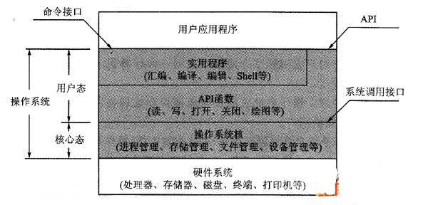

## CPU的用户态和内核态和内存的用户空间内核空间?
谈到CPU的这两个工作状态，也就是处理器的这两个工作状态，那我们有必要说一下为什么搞出这两个鬼玩意出来。  

用过电脑的娃娃们肯定知道在一个系统中既有操作系统的程序，也由普通用户的程序。但那么多指令，可不是随便乱用的，有些指令只能由系统来使用，禁止用户程序去直接访问。为了保证操作系统和各个应用程序能够顺利运行，就必须对他们进行限制，否则的话就根本没有办法保证系统的安全性和稳定。  

所以呢，根据运行程序对资源和机器指令的使用权限，把处理器设置为不同的状态。多数系统把处理器的工作状态分为管态和目态两种。也就是我们今天要说的这两个东西。  

所谓管态，即操作系统的管理程序运行时的状态，它具有较高的特权级别，也称为特权态、系统态、内核态或者核心态。当处理器处于管态时，他可以执行所有的指令，包括各种特权指令，也可以使用所有的资源，并且具有改变处理器状态的能力，是感觉很牛逼。需要指出的是，管态和超级用户不同，前者是指CPU的状态，后者是指一种特殊的计算机用户；前者主要是从硬件的角度去执行任何指令，而后者是从软件的角度来管理系统的软硬件资源，如用户账户、权限管理、文件访问等。超级用户执行的程序不一定运行在管态，而管态程序也不一定由系统管理员启动，普通用户也可以启动。

所谓目态，即用户程序运行时的状态，它具有较低的特权级别，又称为普通态或用户态。在这种状态下不能使用特权指令，不能直接使用系统资源，也不能改变CPU的工作状态，并且只能访问这个用户程序自己的存储空间。用户态不允许程序进行处理器中要求特权态的操作，以避免操作系统崩溃。每个进程都在各自的用户空间中运行，而不允许存取其他程序的用户空间。  
   

当一个任务(进程)执行系统调用而陷入内核代码中执行时，我们就称进程处于内核运行态(或简称为内核态)。此时处理器处于特权级最高的(0级)内核代码中执行。当进程处于内核态时，执行的内核代码会使用当前进程的内核栈。每个进程都有自己的内核栈。当进程在执行用户自己的代码时，则称其处于用户运行态(用户态)。即此时处理器在特权级最低的(3级)用户代码中运行。

在内核态下CPU可执行任何指令，在用户态下CPU只能执行非特权指令。当CPU处于内核态，可以随意进入用户态；而当CPU处于用户态时，用户从用户态切换到内核态只有在系统调用和中断两种情况下发生，一般程序一开始都是运行于用户态，当程序需要使用系统资源时，就必须通过调用软中断进入内核 态。 　　

Linux使用了Ring3级别运行用户态，Ring0作为内核态，没有使用Ring1和Ring2。Ring3状态不能访问Ring0的地址空间，包括代码和数据。Linux进程的4GB地址空间，3G-4G部分大家是共享的，是内核态的地址空间，这里存放在整个内核的代码和所有的内核模块， 以及内核所维护的数据。用户运行一个程序，该程序所创建的进程开始是运行在用户态的，如果要执行文件操作，网络数据发送等操作，必须通过write，send等系统调用，这些系统调用会调用内核中的代码来完成操作，这时，必须切换到Ring0，然后进入3GB-4GB中的内核地址空间去执 行这些代码完成操作，完成后，切换回Ring3，回到用户态。这样，用户态的程序就不能随意操作内核地址空间，具有一定的安全保护作用。

## 用户进程缓冲区和内核缓冲区?
用户进程缓冲区  
用户进程通过系统调用访问系统资源的时候，需要切换到内核态，而这对应一些特殊的堆栈和内存环境，必须在系统调用前建立好。而在系统调用结束后，cpu会从核心模式切回到用户模式，而堆栈又必须恢复成用户进程的上下文。而这种切换就会有大量的耗时。为了优化这一情况，需要在应用程序中加入缓冲区，通过一次操作更多的数据来减少上下文切换。  
你看一些程序在读取文件时，会先申请一块内存数组，称为buffer，然后每次调用read，读取设定字节长度的数据，写入buffer。（用较小的次数填满buffer）。之后的程序都是从buffer中获取数据，当buffer使用完后，在进行下一次调用，填充buffer。  
所以说：用户缓冲区的目的是为了减少系统调用次数，从而降低操作系统在用户态与核心态切换所耗费的时间。

内核缓冲区  
除了在进程中设计缓冲区，内核也有自己的缓冲区。  
当一个用户进程要从磁盘读取数据时，内核一般不直接读磁盘，而是将内核缓冲区中的数据复制到进程缓冲区中。  
但若是内核缓冲区中没有数据，内核会把对数据块的请求，加入到请求队列，然后把进程挂起，为其它进程提供服务。  
等到数据已经读取到内核缓冲区时，把内核缓冲区中的数据读取到用户进程中，才会通知进程，当然不同的io模型，在调度和使用内核缓冲区的方式上有所不同。  
你可以认为，read是把数据从内核缓冲区复制到进程缓冲区。write是把进程缓冲区复制到内核缓冲区。  
当然，write并不一定导致内核的写动作，比如os可能会把内核缓冲区的数据积累到一定量后，再一次写入。这也就是为什么断电有时会导致数据丢失。  
所以说内核缓冲区，是为了在OS级别，提高磁盘IO效率，优化磁盘写操作。

## 关于epoll和select的区别？

## 操作系统的页式存储？