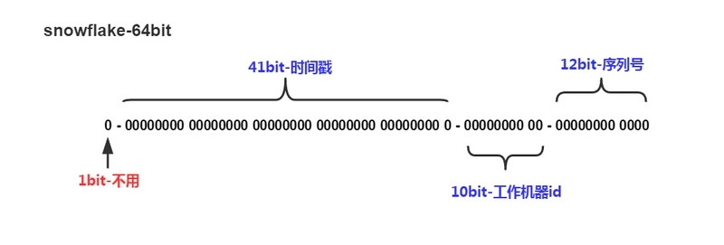

## 数据库中什么是事务？事务的隔离级别？事务的四个特性？什么是脏读，幻读，不可重复读？

## 从innodb的索引结构分析，为什么索引的 key 长度不能太长?

## 分布式ID生成。
首先阐明数据库主键自增和UUID为什么不合适高并发，为什么性能低。  
自增   
1.最致命的一个缺点就是，很容易被别人知晓业务量，然后很容易被网络爬虫教做人。  
2.高并发的情况下，竞争自增锁会降低数据库的吞吐能力。  
3.数据迁移的时候，特别是发生表格合并这种操作的时候，会非常蛋疼。

UUID. 
UUID(Universally Unique Identifier)的标准型式包含32个16进制数字，以连字号分为五段，形式为8-4-4-4-12的36个字符，示例：550e8400-e29b-41d4-a716-446655440000，到目前为止业界一共有5种方式生成UUID。  
优点：  
性能非常高：本地生成，没有网络消耗。  
缺点：  
不易于存储：UUID太长，16字节128位，通常以36长度的字符串表示，很多场景不适用。  
信息不安全：基于MAC地址生成UUID的算法可能会造成MAC地址泄露，这个漏洞曾被用于寻找梅丽莎病毒的制作者位置。  
ID作为主键时在特定的环境会存在一些问题，比如做DB主键的场景下，UUID就非常不适用：  
1.MySQL官方有明确的建议主键要尽量越短越好[4]，36个字符长度的UUID不符合要求。  
2.对MySQL索引不利：如果作为数据库主键，在InnoDB引擎下，表中数据是按照主键顺序存放的。也就是说，不连续的插入行为，会导致InnoDB必须不断的分页（split pages）来创造更多的空间来安插新的数据，也因此创建出来的pages会是相当稀疏且有许多碎片，性能也会极差，频繁的分页移动很耗费性能。  
3.读取出来的数据也是没有规律的，通常需要order by，其实也很消耗数据库资源。

推荐使用：分布式ID算法-SnowFlake. 
SnowFlake算法生成id的结果是一个64bit大小的整数，它的结构如下图：

1位，不用。二进制中最高位为1的都是负数，但是我们生成的id一般都使用整数，所以这个最高位固定是0
41位，用来记录时间戳（毫秒）。

41位可以表示$2^{41}-1$个数字，
如果只用来表示正整数（计算机中正数包含0），可以表示的数值范围是：0 至 $2^{41}-1$，减1是因为可表示的数值范围是从0开始算的，而不是1。  
也就是说41位可以表示$2^{41}-1$个毫秒的值，转化成单位年则是$(2^{41}-1) / (1000 * 60 * 60 * 24 * 365) = 69$年
10位，用来记录工作机器id。

可以部署在$2^{10} = 1024$个节点，包括5位datacenterId和5位workerId
5位（bit）可以表示的最大正整数是$2^{5}-1 = 31$，即可以用0、1、2、3、....31这32个数字，来表示不同的datecenterId或workerId
12位，序列号，用来记录同毫秒内产生的不同id。

12位（bit）可以表示的最大正整数是$2^{12}-1 = 4095$，即可以用0、1、2、3、....4094这4095个数字，来表示同一机器同一时间截（毫秒)内产生的4095个ID序号  
由于在Java中64bit的整数是long类型，所以在Java中SnowFlake算法生成的id就是long来存储的。

SnowFlake可以保证：

所有生成的id按时间趋势递增  
整个分布式系统内不会产生重复id（因为有datacenterId和workerId来做区分）

## mysql自增主键，存在最大值回退风险？
风险在innodb下，自增id最大值不会持久化，当mysql重启后，会执行类似 select max(id) + 1 操作，如果重启前最后几条数据比如说10，11，12删除了，虽然此时的下一个id为13，但重启后却变成了10。业务上可能存在风险。  
建议采用逻辑删除（状态字段改为删除）。物理删除大量行后还会导致索引树不平衡，需要使用 OPTIMIZE TABLE 进行一些维护，才能保持索引的高效。

## mysql表示枚举的字段为什么不用enum类型？
在工作中表示枚举的字段，一般用tinyint类型。  
那为什么不用enum类型呢？下面两个原因  
(1)ENUM类型的ORDER BY操作效率低，需要额外操作  
(2)如果枚举值是数值，有陷阱  
插入枚举需要用 INSERT INTO test VALUES (\`1\`);  
不能使用INSERT INTO test VALUES (1);  

## mysql货币字段用什么类型?
如果货币单位是分，可以用Int类型。如果坚持用元，用Decimal。  
千万不要答float和double，因为float和double是以二进制存储的，所以有一定的误差。  
比如 一个字段是 \`price\` float(10,2)   
如果插入值为1234567.23，但实际结果1234567.25，精度失准！  

MySQL DECIMAL数据类型用于在数据库中存储精确的数值。我们经常将DECIMAL数据类型用于保留准确精确度的列，例如会计系统中的货币数据。  
要定义数据类型为DECIMAL的列，请使用以下语法：  
column_name  DECIMAL(P,D);  
在上面的语法中：  
P是表示有效数字数的精度。 P范围为1〜65。  
D是表示小数点后的位数。 D的范围是0~30。MySQL要求D小于或等于(<=)P。  
DECIMAL(P，D)表示列可以存储D位小数的P位数。十进制列的实际范围取决于精度和刻度。  
常用：  
amount DECIMAL(19,4);  
因为 CPU 不支持对 DEClMAL 的直接计算，所以在 MySQL 5.0 以及更高版本中， MySQL 服务器自身实现了 DECIMAL 的高精度计算。相对而言， CPU 直接支持原生浮点计算，所 以浮点运算明显更快。  
因为需要额外的空间和计算开销，所以应该尽量只在对小数进行精确计算时才使用。  
DECIMAL一一例如存储财务数据。但在数据量比较大的时候，可以考虑使用BIGINT代替，最后两位是角分，只要定义好元的位置就可以。

## mysql 时间字段用什么类型?
varchar，如果用varchar类型来存时间，优点在于显示直观。但是坑的地方也是挺多的。比如，插入的数据没有校验，你可能某天就发现一条数据为2013111的数据，请问这是代表2013年1月11日，还是2013年11月1日？  
其次，做时间比较运算，你需要用STR_TO_DATE等函数将其转化为时间类型，你会发现这么写是无法命中索引的。数据量一大，是个坑！   
timestamp，该类型是四个字节的整数，它能表示的时间范围为1970-01-01 08:00:01到2038-01-19 11:14:07。2038年以后的时间，是无法用timestamp类型存储的。  
但是它有一个优势，timestamp类型是带有时区信息的。一旦你系统中的时区发生改变,
项目中的该字段的值自己会发生变更。这个特性用来做一些国际化大项目，跨时区的应用时，特别注意！  
datetime，datetime储存占用8个字节，它存储的时间范围为1000-01-01 00:00:00 ~ 9999-12-31 23:59:59。显然，存储时间范围更大。但是它坑的地方在于，他存储的是时间绝对值，不带有时区信息。如果你改变数据库的时区，该项的值不会自己发生变更！  
bigint，也是8个字节，自己维护一个时间戳，表示范围比timestamp大多了，就是要自己维护，不大方便。

## 为什么不推荐使用text和blob类型？
主要原因有如下两点  
(1)Mysql内存临时表不支持TEXT、BLOB这样的大数据类型，如果查询中包含这样的数据，在排序等操作时，就不能使用内存临时表，必须使用磁盘临时表进行。导致查询效率缓慢  
(2)binlog内容太多。因为你数据内容比较大，就会造成binlog内容比较多。大家也知道，主从同步是靠binlog进行同步，binlog太大了，就会导致主从同步效率问题！

## mysql字段为什么要定义为NOT NULL?
（1）NOT IN、!= 等负向条件查询在有 NULL 值的情况下返回永远为空结果，查询容易出错。（也就是说无法过通过not in ，!= 查出字段为null的记录）同时，当计算count时候null column不会计入统计。  
（2）在数据库里是严格区分的，任何数跟NULL进行运算都是NULL, 判断值是否等于NULL，不能简单用=，而要用IS NULL关键字。  
（3）含有空值的列很难进行查询优化，而且对表索引时不会存储NULL值的，所以如果索引的字段可以为NULL，索引的效率会下降很多。因为它们使得索引、索引的统计信息以及比较运算更加复杂。你应该用0、一个特殊的值或者一个空串代替空值。  
（4）“”空字符串不占空间，但null反而需要一个字节的空间。

## 什么是索引?
索引是一种数据结构,可以帮助我们快速的进行数据的查找。

## 索引是个什么样的数据结构呢?
索引的数据结构和具体存储引擎的实现有关, 在MySQL中使用较多的索引有Hash索引,B+树索引等,而我们经常使用的InnoDB存储引擎的默认索引实现为:B+树索引。

## Hash索引和B+树所有有什么区别或者说优劣呢?
hash索引底层就是hash表,进行查找时,调用一次hash函数就可以获取到相应的键值,之后进行回表查询获得实际数据.B+树底层实现是多路平衡查找树.对于每一次的查询都是从根节点出发,查找到叶子节点方可以获得所查键值,然后根据查询判断是否需要回表查询数据。  
那么可以看出他们有以下的不同:   
1.hash索引进行等值查询更快(一般情况下),但是却无法进行范围查询。   
因为在hash索引中经过hash函数建立索引之后,索引的顺序与原顺序无法保持一致,不能支持范围查询.而B+树的的所有节点皆遵循(左节点小于父节点,右节点大于父节点,多叉树也类似),天然支持范围。 
2.hash索引不支持使用索引进行排序,原理同上。  
3.hash索引不支持模糊查询以及多列索引的最左前缀匹配.原理也是因为hash函数的不可预测.AAAA和AAAAB的索引没有相关性。  
4.hash索引任何时候都避免不了回表查询数据,而B+树在符合某些条件(聚簇索引,覆盖索引等)的时候可以只通过索引完成查询。  
5.hash索引虽然在等值查询上较快,但是不稳定.性能不可预测,当某个键值存在大量重复的时候,发生hash碰撞,此时效率可能极差.而B+树的查询效率比较稳定,对于所有的查询都是从根节点到叶子节点,且树的高度较低。  

因此,在大多数情况下,直接选择B+树索引可以获得稳定且较好的查询速度.而不需要使用hash索引。

## 上面提到了B+树在满足聚簇索引和覆盖索引的时候不需要回表查询数据,什么是聚簇索引?
**聚簇索引**  
表数据按照索引的顺序来存储的，也就是说索引项的顺序与表中记录的物理顺序一致。对于聚集索引，**[叶子结点]**即存储了真实的数据行，不再有另外单独的数据页。在一张表上最多只能创建一个聚集索引，因为真实数据的物理顺序只能有一种。  
**非聚簇索引**  
表数据存储顺序与索引顺序无关（索引有自己的顺序）。对于非聚簇索引，**[叶结点]**包含索引字段值及指向数据页数据行的逻辑指针，其行数量与数据表行数据量一致。

以上是概念，在mysql的innodb中，在聚簇索引之上创建的索引称之为辅助索引，非聚簇索引都是辅助索引，像复合索引、前缀索引、唯一索引。辅助索引叶子节点存储的不再是行的物理位置，而是主键值，辅助索引访问数据总是需要二次查找。可以看到二级索引存的是主键值，和概念有区别。  
当查询使用聚簇索引时,在对应的叶子节点,可以获取到整行数据,因此不用再次进行回表查询。

## 非聚簇索引一定会回表查询吗?
不一定,这涉及到查询语句所要求的字段是否全部命中了索引,如果全部命中了索引,那么就不必再进行回表查询.

举个简单的例子,假设我们在员工表的年龄上建立了索引,那么当进行select age from employee where age < 20的查询时,在索引的叶子节点上,已经包含了age信息,不会再次进行回表查询。

## 在建立索引的时候,都有哪些需要考虑的因素呢?
建立索引的时候一般要考虑到字段的使用频率,经常作为条件进行查询的字段比较适合.如果需要建立联合索引的话,还需要考虑联合索引中的顺序.此外也要考虑其他方面,比如防止过多的所有对表造成太大的压力.这些都和实际的表结构以及查询方式有关。

## 联合索引是什么?为什么需要注意联合索引中的顺序?
MySQL可以使用多个字段同时建立一个索引,叫做联合索引.在联合索引中,如果想要命中索引,需要按照建立索引时的字段顺序挨个使用,否则无法命中索引（最左前缀原则）。ABC三个字段上做了联合索引，条件中有ABC字段则索引起效，同时A，AB，AC（这个也会，5.6版本前和只有A一样，之后有了索引下推索引效果更好），这里说下BA，CBA都会走索引，不能只按字面意思理解。顺序的意思是条件中存在的字段必须按索引顺序来，才会走索引，即不能少了联合索引前面的字段。  

## 创建的索引有没有被使用到?或者说怎么才可以知道这条语句运行很慢的原因？
MySQL提供了explain命令来查看语句的执行计划,MySQL在执行某个语句之前,会将该语句过一遍查询优化器,之后会拿到对语句的分析,也就是执行计划,其中包含了许多信息. 可以通过其中和索引有关的信息来分析是否命中了索引,例如possilbe_key,key,key_len等字段,分别说明了此语句可能会使用的索引,实际使用的索引以及使用的索引长度。  
重点是rows，key, type，extra。  

## 那么在哪些情况下会发生针对该列创建了索引但是在查询的时候并没有使用呢?
1.使用不等于查询。  
2.列参与了数学运算或者函数。  
3.在字符串like时左边是通配符.类似于'%aaa'。   
4.当mysql分析全表扫描比使用索引快的时候不使用索引。  
5.当使用联合索引,前面一个条件为范围查询,后面的即使符合最左前缀原则,也无法使用索引。  
...... 
很多很多，这里只列举最常见的。

## 什么是事务?
理解什么是事务最经典的就是转账的例子,自行脑补。  
事务是一系列的操作,他们要符合ACID特性.最常见的理解就是:事务中的操作要么全部成功,要么全部失败.但是只是这样还不够的。  

## ACID是什么?可以详细说一下吗?
**A=Atomicity**  
原子性，就是上面说的,要么全部成功,要么全部失败.不可能只执行一部分操作。  
**C=Consistency**  
一致性，系统(数据库)总是从一个一致性的状态转移到另一个一致性的状态,不会存在中间状态。  
**I=Isolation**  
隔离性，“通常”来说:一个事务在完全提交之前,对其他事务是不可见的.注意前面的通常来说加了引号,意味着有例外情况。  
**D=Durability**
持久性，一旦事务提交,那么就永远是这样子了,哪怕系统崩溃也不会影响到这个事务的结果。  
## 同时有多个事务在进行会怎么样呢?
多事务的并发进行一般会造成以下几个问题:  
1.脏读: A事务读取到了B事务未提交的内容,而B事务后面进行了回滚。  
2.不可重复读: 当设置A事务只能读取B事务已经提交的部分,会造成在A事务内的两次查询,结果竟然不一样,因为在此期间B事务进行了提交操作。  
3.幻读: A事务读取了一个范围的内容,而同时B事务在此期间插入了一条数据.造成"幻觉"。  

## 怎么解决这些问题呢?MySQL的事务隔离级别了解吗?
MySQL的四种隔离级别如下:  
**读未提交(READ UNCOMMITTED)**  
这个隔离级别下,其他事务可以看到本事务没有提交的部分修改.因此会造成脏读的问题(读取到了其他事务未提交的部分,而之后该事务进行了回滚)。  
这个级别的性能没有足够大的优势,但是又有很多的问题,因此很少使用。  
**已提交读(READ COMMITTED)**   
其他事务只能读取到本事务已经提交的部分.这个隔离级别解决了脏读的问题，但有不可重复读的问题,在同一个事务内的两次读取,拿到的结果竟然不一样,因为另外一个事务对数据进行了修改。  
**可重复读(REPEATABLE READ)**   
可重复读隔离级别解决了上面不可重复读的问题(看名字也知道),但是仍然有一个新问题,就是幻读,表开始有一个id=3的记录，会话1首先开启了一个事务，然后查找id>2的记录，会发现结果只有一个记录，且只对这一条记录加了读锁，然后会话2开启事务插入了id=5的一个记录，然后提交。这时候会话1再次查找id>2的记录，如果存在幻读，则这时候会话1会看到两条记录。  
**可串行化(SERIALIZABLE)**  
这是最高的隔离级别,可以解决上面提到的所有问题,因为他强制将所以的操作串行执行,这会导致并发性能极速下降,因此也不是很常用。  

