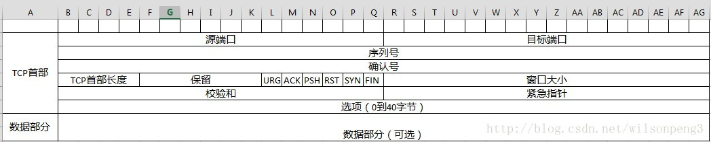

## http1.0和http1.1和http2.0有什么区别
**HTTP1.0和HTTP1.1的区别**  
1.HTTP 1.0需要使用keep-alive参数来告知服务器端要建立一个长连接，而HTTP1.1默认支持长连接，且同时支持pipelining，可以做到多个请求在同一个长连接里完成。  
2.Host头处理，HTTP1.0请求消息中没有传递主机名（hostname），HTTP1.1中支持Host，而且不传会报错。Host主要区分一台服务器上的多个虚拟主机。  
3.HTTP1.1中添加了range头域，支持了断点续传。  
**HTTP1.1和HTTP2.0的区别**  
1.新的二进制格式（Binary Format），HTTP1.x的解析是基于文本。  
2.多路复用（MultiPlexing），即连接共享，即每一个request都是是用作连接共享机制的。同一个连接上多个请求，不需要等待前一个请求完成，并发进行，解决了线头阻塞的问题。  
3.header压缩。HTTP2.0使用encoder来减少需要传输的header大小，通讯双方各自cache一份header fields表，既避免了重复header的传输，又减小了需要传输的大小。  
4.服务端推送（server push），HTTP2.0也具有server push功能（不是websocket哦，HTTP1.1也可以用websocket）。	

题外话  
SSE（Server-Sent Events一中推送技术）：SSE 与 WebSocket 作用相似，都是建立浏览器与服务器之间的通信渠道，然后服务器向浏览器推送信息。  
SSE发送的不是一次性的数据包，而是一个数据流，会连续不断地发送过来。这时，客户端不会关闭连接，会一直等着服务器发过来的新的数据流，视频播放就是这样的例子。本质上，这种通信就是以流信息的方式，完成一次用时很长的下载。  
总体来说，WebSocket 更强大和灵活。因为它是全双工通道，可以双向通信；SSE 是单向通道，只能服务器向浏览器发送，因为流信息本质上就是下载。如果浏览器向服务器发送信息，就变成了另一次 HTTP 请求。  

## Http请求的过程与原理？
第一步：通过 DNS 进行域名解析，得到 IP 地址；  
第二步：找到 IP 地址对应的服务器，通过三次握手建立 TCP 连接，向服务器发送 HTTP Request 请求，并得到服务器的 Response 响应；  
第三步：浏览器根据响应结果渲染输出页面。  

> [HTTP请求过程原理](http://helloweb.wang/jingyan/3587.html)

## 说说你知道的几种HTTP响应码？
几乎所有的HTTP状态码都被分成了五大类：  
1开头的表示服务器收到请求并需要请求这继续处理；  
2开头的成功响应，表示成功处理了请求；  
3开头的重定向，引导浏览器跳转到另一个资源页面；  
4开头的表示客户端错误状态码；  
5开头的表示服务器错误状态码； 

| 状态码 | 作用 |
| --- | --- |
| 200 OK | 请求已成功 |
| 204 No Content | 请求成功，但没有任何内容 |
| 206 Partial Content | 服务器返回了部分内容，需要有range头信息配合 |
| 301 Moved Permanently | 永久重定向，下次根据浏览器本地缓存的重定向地址进行重定向 |
| 302 Move temporarily | 临时重定向，每次都访问原地址，然后根据返回重定向 |
| 304 Not Modified | 内容没有改变，服务端判断没有内容修改后，返回头信息和一个空行，没有消息体 |
| 400 Bad Request | 参数错误等，请求不被服务端接受 |
| 401 Unauthorized | 没有权限，请求需要用户验证 |
| 403 Forbidden | 请求被拒绝执行 |
| 404 Not Found | 没有找到内容，地址不存在 |
| 405 Method Not Allowed | 服务端不允许客户端使用的http method |
| 408 Request Timeout | 请求超时 |
| 500 Internal Server Error | 服务器内部错误 |
| 502 Bad Gateway | 网关判断服务器已关闭等情况 |
| 503 Service Unavailable | 服务器暂时不可用，可能在后面时间内恢复 |
| 504 Gateway Timeout | 网关请求服务器超时 |

## TCP连接的特点？
**UDP主要特点**  
（1）**UDP是无连接的**，即发送数据之前不需要建立连接（当然，发送数据结束时也没有连接可以释放），因此减少了开销和发送数据之前的时延。  
（2）**UDP使用尽最大努力交付**，即不保证可靠交付，因此主机不需要维持复杂的连接状态表（这里面有很多参数）。  
（3）**UDP是面向报文的**。发送方的UDP对应用程序交下来的报文，在添加首部后就向下交付IP层。UDP对应用层交下来的报文，既不合并，也不拆分，而是保留这些报文的边界。这就是说，应用层交给UDP多长的报文，UDP就照样发送，即一次发送一个报文。  
（4）**UDP没有拥塞控制**，因此网络出现的拥塞不会使源主机的发送速率降低。但是不使用拥塞控制功能的UDP有可能会引起网络产生严重的拥塞问题。  
（5）**UDP支持一对一、一对多、多对一和多对多的交互通信**。  
（6）**UDP的首部开销小**，只有8个字节，比TCP的20个字节的首部还要短。  
**TCP主要特点**  
（1）**TCP是面向连接的运输层协议**。应用程序在使用TCP协议之前，必须先建立TCP连接，在传送数据完毕后，必须释放已经建立的TCP连接。
（2）**每一条TCP连接只能有两个端点，即点对点的**。  
（3）**TCP提供可靠交付的服务**。通过TCP连接传送的数据，无差错、不丢失、不重复、并且按序到达。  
（4）**TCP提供全双工通信**。TCP允许通信双方的应用进程在任何时候都能发送数据。  
（5）**面向字节流**。TCP中的“流”指的是流入到进程或从进程流出的字节序列。面向字节流的含义是：虽然应用程序和TCP的交互是一次一个数据块（大小不等），但是TCP把应用程序交下来的数据仅仅看成是一连串的无结构的字节流。  

## TCP连接如何保证安全可靠的？数据包有哪些数据组成？
1、**将数据截断为合理的长度**，应用数据被分割成TCP认为最适合发送的数据块。这和UDP完全不同，应用程序产生的数据报长度将保持不变。   
2、**超时重发**，当TCP发出一个段后，它启动一个定时器，等待目的端确认收到这个报文段。如果不能及时收到一个确认，将重发这个报文段。   
3、**对于收到的请求，给出确认响应**，当TCP收到发自TCP连接另一端的数据，它将发送一个确认。这个确认不是立即发送，通常将推迟几分之一秒 。 (之所以推迟，可能是要对包做完整校验)  
4、**完整性校验**，校验出包有错，丢弃报文段，不给出响应，TCP发送数据端，超时时会重发数据。TCP将保持它首部和数据的检验和。这是一个端到端的检验和，目的是检测数据在传输过程中的任何变化。如果收到段的检验和有差错，TCP将丢弃这个报文段和不确认收到此报文段。   
5、**对失序数据进行重新排序，然后才交给应用层**，既然TCP报文段作为IP数据报来传输，而IP数据报的到达可能会失序，因此TCP报文段的到达也可能会失序。如果必要，TCP将对收到的数据进行重新排序，将收到的数据以正确的顺序交给应用层。   
6、**对于重复数据，能够丢弃重复数据**，既然IP数据报会发生重复，TCP的接收端必须丢弃重复的数据。  
7、**TCP可以进行流量控制，防止较快主机致使较慢主机的缓冲区溢出**，TCP还能提供流量控制。TCP连接的每一方都有固定大小的缓冲空间。TCP的接收端只允许另一端发送接收端缓冲区所能接纳的数据。这将防止较快主机致使较慢主机的缓冲区溢出。TCP使用的流量控制协议是可变大小的滑动窗口协议。  

**TCP保证消息顺序：**  
主机每次发送数据时，TCP就给每个数据包分配一个序列号并且在一个特定的时间内等待接收主机对分配的这个序列号进行确认，如果发送主机在一个特定时间内没有收到接收主机的确认，则发送主机会重传此数据包。接收主机利用序列号对接收的数据进行确认，以便检测对方发送的数据是否有丢失或者乱序等，接收主机一旦收到已经顺序化的数据，它就将这些数据按正确的顺序重组成数据流并传递到高层进行处理。

**数据包有哪些数据组成**  

源端口、目标端口：计算机上的进程要和其他进程通信是要通过计算机端口的，而一个计算机端口某个时刻只能被一个进程占用，所以通过指定源端口和目标端口，就可以知道是哪两个进程需要通信。源端口、目标端口是用16位表示的，可推算计算机的端口个数为2^16个。  

序列号：表示本报文段所发送数据的第一个字节的编号。在TCP连接中所传送的字节流的每一个字节都会按顺序编号。由于序列号由32位表示，所以每2^32个字节，就会出现序列号回绕，再次从 0 开始。那如何区分两个相同序列号的不同TCP报文段就是一个问题了，后面会有答案，暂时可以不管。

确认号：表示接收方期望收到发送方下一个报文段的第一个字节数据的编号。也就是告诉发送发：我希望你（指发送方）下次发送的数据的第一个字节数据的编号是这个确认号。也就是告诉发送方：我希望你（指发送方）下次发送给我的TCP报文段的序列号字段的值是这个确认号。

TCP首部长度：由于TCP首部包含一个长度可变的选项部分，所以需要这么一个值来指定这个TCP报文段到底有多长。或者可以这么理解：就是表示TCP报文段中数据部分在整个TCP报文段中的位置。该字段的单位是32位字，即：4个字节。

URG：表示本报文段中发送的数据是否包含紧急数据。URG=1，表示有紧急数据。后面的紧急指针字段只有当URG=1时才有效。

ACK：表示是否前面的确认号字段是否有效。ACK=1，表示有效。只有当ACK=1时，前面的确认号字段才有效。TCP规定，连接建立后，ACK必须为1。

PSH：告诉对方收到该报文段后是否应该立即把数据推送给上层。如果为1，则表示对方应当立即把数据提交给上层，而不是缓存起来。

RST：只有当RST=1时才有用。如果你收到一个RST=1的报文，说明你与主机的连接出现了严重错误（如主机崩溃），必须释放连接，然后再重新建立连接。或者说明你上次发送给主机的数据有问题，主机拒绝响应。

SYN：在建立连接时使用，用来同步序号。当SYN=1，ACK=0时，表示这是一个请求建立连接的报文段；当SYN=1，ACK=1时，表示对方同意建立连接。SYN=1，说明这是一个请求建立连接或同意建立连接的报文。只有在前两次握手中SYN才置为1。

FIN：标记数据是否发送完毕。如果FIN=1，就相当于告诉对方：“我的数据已经发送完毕，你可以释放连接了”

窗口大小：表示现在运行对方发送的数据量。也就是告诉对方，从本报文段的确认号开始允许对方发送的数据量。

校验和：提供额外的可靠性。具体如何校验，参考其他资料。

紧急指针：标记紧急数据在数据字段中的位置。

选项部分：其最大长度可根据TCP首部长度进行推算。TCP首部长度用4位表示，那么选项部分最长为：(2^4-1)*4-20=40字节。

选项部分的应用：

1.**MSS最大报文段长度(Maxium Segment Size)**：指明数据字段的最大长度，数据字段的长度加上TCP首部的长度才等于整个TCP报文段的长度。MSS值指示自己期望对方发送TCP报文段时那个数据字段的长度。通信双方可以有不同的MSS值。如果未填写，默认采用536字节。MSS只出现在SYN报文中。即：MSS出现在SYN=1的报文段中。  
2.**窗口扩大选项(Windows Scaling)**：由于TCP首部的窗口大小字段长度是16位，所以其表示的最大数是65535。但是随着时延和带宽比较大的通信产生（如卫星通信），需要更大的窗口来满足性能和吞吐率，所以产生了这个窗口扩大选项。  
3.**SACK选择确认项(Selective Acknowledgements)**：用来确保只重传缺少的报文段，而不是重传所有报文段。比如主机A发送报文段1、2、3，而主机B仅收到报文段1、3。那么此时就需要使用SACK选项来告诉发送方只发送丢失的数据。那么又如何指明丢失了哪些报文段呢？使用SACK需要两个功能字节。一个表示要使用SACK选项，另一个指明这个选项占用多少字节。描述丢失的报文段2，是通过描述它的左右边界报文段1、3来完成的。而这个1、3实际上是表示序列号，所以描述一个丢失的报文段需要64位即8个字节的空间。那么可以推算整个选项字段最多描述(40-2)/8=4个丢失的报文段。  
4.**时间戳选项（Timestamps）**：可以用来计算RTT(往返时间)，发送方发送TCP报文时，把当前的时间值放入时间戳字段，接收方收到后发送确认报文时，把这个时间戳字段的值复制到确认报文中，当发送方收到确认报文后即可计算出RTT。也可以用来防止回绕序号PAWS，也可以说可以用来区分相同序列号的不同报文。因为序列号用32为表示，每2^32个序列号就会产生回绕，那么使用时间戳字段就很容易区分相同序列号的不同报文。  
5.**NOP(NO-Operation)**：它要求选项部分中的每种选项长度必须是4字节的倍数，不足的则用NOP填充。同时也可以用来分割不同的选项字段。如窗口扩大选项和SACK之间用NOP隔开。  

## TCP为什么引入接受缓存这个数据结构？
如果没有接受缓存的话，或者说只有一个缓存的话，为了保证接受的数据是按顺序传输的，所以如果位于x序号之后的序号分组先到达目的主机的运输层的话必然丢弃，这样的话将在重传上花费很大的开销，所以一般如果有过大的序号达到接收端，那么会按照序号缓存起来等待之前的序号分许到达，然后一并交付到应用进程。

## TCP三次握手和四次挥手的流程，为什么断开连接要4次，为什么TCP连接需要三次握手，两次不可以吗，为什么？

## TIME_WAIT和CLOSE_WAIT的区别？关闭连接时，出现TIMEWAIT过多是由什么原因引起，是出现在主动断开方还是被动断开方？